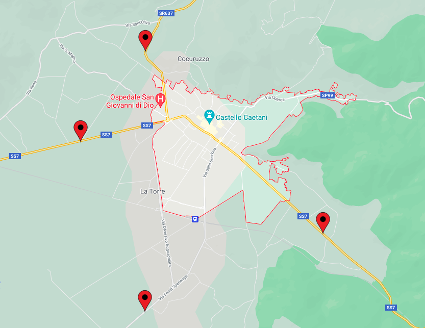
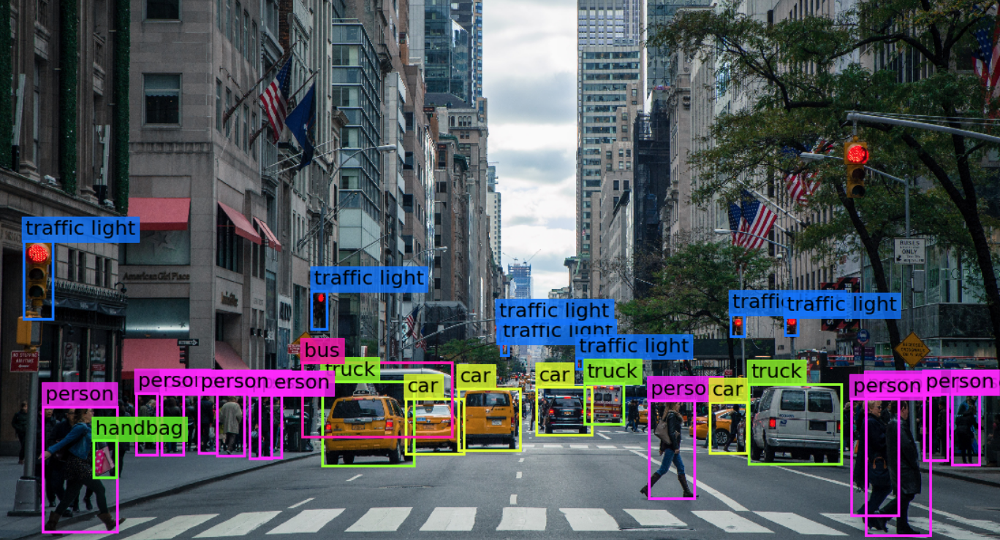
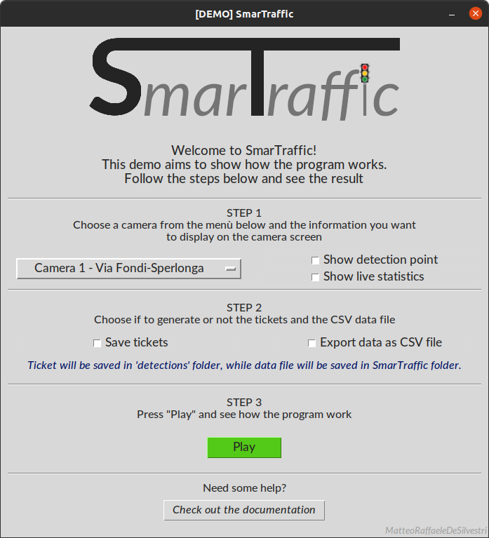

# SmarTraffic

## Tabel of content

* [Introduction](#Introduction "Go to the section")
    - [The idea](#The-idea "Go to the subsection")
* [Setup](#Setup "Go to the section")
* [How it works](#How-it-works "Go to the section")
    - [GUI](#GUI "Go to the subsection")
    - [Video](#Video "Go to the subsection")
    - [File management](#File-management "Go to the subsection")
* [Practical application](#Practical-application "Go to the section")
* [License](#License "Go to the section")

## Introduction

<b>SmarTraffic</b> is the result of the Virtual Internship born from the collaboration between <i>VGen</i> and <i>Accenture</i>. 
The goal of this internship is to give the participants an introduction to the <i>AI</i> and <i>computer vision</i> world by realizing a project using the following tecnologies:

- <b>Python</b> as programming language;
- <b>OpenCV</b> as reference library for computer vision tasks;
- <b>Yolo</b> as object detection system (<i>this project use YoloV4</i>).

### The idea

I live in Fondi, a town in province of Latin (Italy). Even if this town is not so big, it's full of life and this implies that our roads are often full of traffic. So i decided to base my project on it.

Fondi has four main access roads from the nearby towns:



Traffic in town can be more or less heavy depending on the amount and the type of entering and leaving vehicles, and because there are four main ways to enter and leave the town 
(<i>SP99 is a mountain road, generally not very busy</i>), i decided to use four different cameras (one for each road) to keep track of the traffic.

Making some research about the existing technologies to accomplish this task, i realised that is a very common practice to put the result of detection directly <i>"on top"</i> of the image (or <i>frame</i> in case of video) the detection has been done.



Even if this practice give result that are cool to see in a real case scenario it's useless. Considering that <i><b>object recognition systems</b></i> works as emulator of human capability to see and identify objects, in a situation where there is someone watching directly at the screen there is no point to have all those colorfull things on the image. For a person is just easyer to look directly at the screen and figure out what he is looking at by themself.

SmarTraffic goal is to create a <i>real-time traffic control system</i> that allow the operator to be more efficient at work instead of just looking straight at the monitor for hours.

In particular, this project is mean to realise a <b>real-time traffic control system</b> that help operators to control and prevent traffic anomalies such as heavy traffic, accident, etc. by automating all the operations that normally would be performed by a human:

- Traffic visualization in real time (<i>trough live cameras</i>);
- Calculate the quantity and direction of vehicles in transit;
- Estimate city traffic conditions level based on the quantity and type of vehicles entering and leaving it;
- For each vehicle in transit identify data such as the <i>route on which it transits</i>, <i>type</i>, <i>direction</i> (entering or leaving the town), <i>date</i> and <i>time</i> of transit, etc;
- Identify abnormal and/or potentially dangerous situations;
- Collect data for long-term traffic analysis and prediction.

## Setup

The program has been written in <b><i>Python 3.8.5</i></b>.<br>
In addition, the following libraries are required:

<ul>
    <li><b>OpenCV</b> (version: <i>4.5.1.48</i>);</li>
    <li><b>Pillow</b> (version: <i>8.2.0</i>).</li>
</ul>

If not already installed on the system, they can be installed both individually (<u><i>is strongly suggested to install the exact verison specified for each library</i></u>) or by following the instructions below:

1. Open the terminal in the folder <b><i>SmarTraffic</i></b>;

2. Type the following command in the terminal:

    ```console
    pip3 install -r requirements.txt
    ```

## How it works

The idea this project is based on is to find a way to use <b><i>real-time detection</i></b> that is fast to develop, easy to maintain, potentially scalable and usable in a real case scenario.

### GUI

SmarTraffic has a simple <i>graphic user interface</i> (<i>GUI</i>) that help the user to acces the informations he need.



# Describe gui function [...]

### Video

### File management

## Practical application

Explain how the information can be used in practical way

## License

[MIT License](LICENSE) - <i> Copyright (c) 2021 </i>
