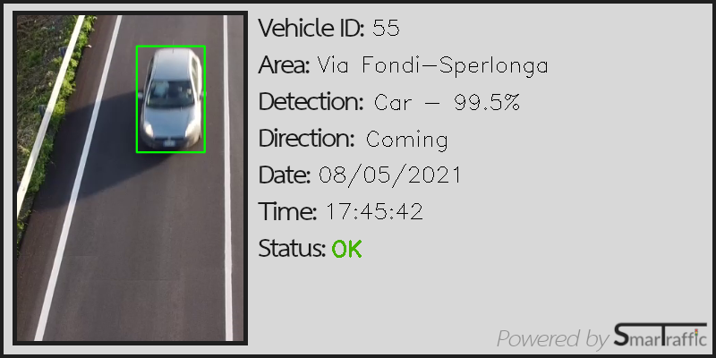

# SmarTraffic

## Tabel of content

* [Introduction](#Introduction "Go to the section")
    * [The idea](#The-idea "Go to the subsection")
* [Setup](#Setup "Go to the section")
* [How it works](#How-it-works "Go to the section")
    * [GUI](#GUI "Go to the subsection")
    * [Video](#Video "Go to the subsection")
    * [File management](#File-management "Go to the subsection")
* [Practical application](#Practical-application "Go to the section")
* [Possible improvements](#Possible-improvements "Go to the section")
* [License](#License "Go to the section")

## Introduction

<b>SmarTraffic</b> is the result of the Virtual Internship born from the collaboration between <i>VGen</i> and <i>Accenture</i>. 
The goal of this internship is to give the participants an introduction to the <i>AI</i> and <i>computer vision</i> world by realizing a project using the following tecnologies:

- <b>Python</b> as programming language;
- <b>OpenCV</b> as reference library for computer vision tasks;
- <b>Yolo</b> as object detection system (<i>this project use YoloV4</i>).

### The idea

I live in Fondi, a town in province of Latin (Italy). Even if this town is not so big, it's full of life and this implies that our roads are often full of traffic. So i decided to base my project on it.

Fondi has four main access roads from the nearby towns:


Traffic in town can be more or less heavy depending on the amount and the type of entering and leaving vehicles, and because there are four main ways to enter and leave the town 
(<i>without considering SP99 that is a mountain road, generally not very busy</i>), i decided to use four different cameras (one for each road) to keep track of the traffic.

Making some research about the existing technologies to accomplish this task, i realised that is a very common practice to put the result of detection directly <i>"on top"</i> of the image (or <i>frame</i> in case of video) the detection has been done.


Even if this practice give result that are cool to see, in a real case scenario it's useless. Considering that <i><b>object recognition systems</b></i> works as emulator of human capability to see and identify objects, in a situation where there is someone watching directly at the screen there is no point to have all those colorfull things on the image. For a person is just easyer to look directly at the screen and figure out what he is looking at by themself.

SmarTraffic goal is to create a <i>real time traffic control system</i> that make operators work more efficient, by helping them to control and prevent traffic anomalies (such as heavy traffic, accident, etc.) by automating all the operations that normally would be performed by a human:

- Traffic visualization in real time (<i>trough live cameras</i>);
- Calculate the quantity and direction of vehicles in transit;
- Estimate city traffic conditions level based on the quantity and type of vehicles entering and leaving it;
- For each vehicle in transit identify data such as the <i>route on which it transits</i>, <i>type</i>, <i>direction</i> (entering or leaving the town), <i>date</i> and <i>time</i> of transit, etc;
- Identify abnormal and/or potentially dangerous situations;
- Collect data for long-term traffic analysis and prediction.

<b>NOTE</b>: <i>Actually this is a demo version of SmarTraffic. There are a lot of improvements that can be done to make this program more efficient and useful. Check out the [Possible improvements](#Possible-improvements "Go to the section") section to learn more about.</i> 

## Setup

The program has been written in <b><i>Python 3.8.5</i></b>.<br>
In addition, the following libraries are required:

- <b>OpenCV</b> (version: <i>4.5.1.48</i>);
- <b>Pillow</b> (version: <i>8.2.0</i>).

If not already installed on the system, they can be installed both individually (<u><i>is strongly suggested to install the exact verison specified for each library</i></u>) or by following the instructions below:

1. Open the terminal in the folder <b><i>SmarTraffic</i></b>;

2. Type the following command in the terminal:

    ```console
    pip3 install -r requirements.txt
    ```

Before running the program, it's important to download the following file and put it manually in the respective folders (overwriting the existingone):

* <b>yolo/</b>[<b>yolov4.weights</b>](https://github.com/MatteoRaffaeleDeSilvestri/SmarTraffic/blob/master/yolo/yolov4.weights) [<i>246.0 Mb</i>]
* <b>video/</b>[<b>camera_1.mp4</b>](https://github.com/MatteoRaffaeleDeSilvestri/SmarTraffic/blob/master/video/camera_1.mp4) [<i>36.9 Mb</i>]
* <b>video/</b>[<b>camera_2.mp4</b>](https://github.com/MatteoRaffaeleDeSilvestri/SmarTraffic/blob/master/video/camera_2.mp4) [<i>64.9 Mb</i>]
* <b>video/</b>[<b>camera_3.mp4</b>](https://github.com/MatteoRaffaeleDeSilvestri/SmarTraffic/blob/master/video/camera_3.mp4) [<i>27.6 Mb</i>]
* <b>video/</b>[<b>camera_4.mp4</b>](https://github.com/MatteoRaffaeleDeSilvestri/SmarTraffic/blob/master/video/camera_4.mp4) [<i>38.0 Mb</i>]

<i>This action is required because the size of this file is too big for GitHub to store directly, so it's been used the LTS GitHub cloud service.</i>

To run the program just go to the project folder and excute the following command:

```console
python main.py
```

<mark><b>IMPORTANT: </b>This program use <u>multiprocessing module</u> (included in <i>Python Standard Library</i>) to simulate real-time object detection. Because the code has been written and tested on Linux OS (<i>Ubuntu 20.04</i>) and considering that different OS handle process differently, the way this operation is executed can be different from one OS to another. In particular, for "non-Linux" OS, the operation of detection are made AFTER playing the video, instead of simultaneously.</mark>

## How it works

### GUI

At the start the following screen will appear:


SmarTraffic has a simple <i>graphic user interface</i> (<i>GUI</i>) that help the user to acces the informations he need.

The GUI has the following structure:

* SmarTraffic logo and welcome message for the user;

* <b>STEP 1</b>: Here the user can choose one of the four camera source (each camera has the name of the road on which it's placed and each video last about a minute). The user can also choose if to see or not the detection point and the live statistics on the screen;

* <b>STEP 2</b>: In this section the user can choose if to save or not the file generated by the detection system. The file that can be generated are:
    
    * <u>Ticket file</u> ("<i>.png</i>"): contains information about the detection made;

        

        The destination folder for tickets is <i><b>detections</b></i>. This folder is generated when is required to save tickets. This folder is emptied every time a new detection is made and is required to save new tickets.  
    
    * <u>Data file</u> ("<i>.csv</i>"): save a record for each detection made.

        

        Data file is saved directly in <i><b>SmarTraffic</b></i> folder and the file is deleted until a new detection is started and is required to save other data.

    The idea behind this two methods is that the first one can be used to have  immediate information about each detection, while the second one can be use for long term purposes (<i>e.g. traffic prevision</i>);

* <b>STEP 3</b>: Just press "<i>Play</i>" button;

    <b>NOTE</b>: Once the video is terminated, the program will take a few moments to complete the analysis of detections. Until then, "Play" button will not be "<i>clickable</i>" ("<i>Playing</i>" button will be shown instead).

* "<i>Help</i>" section: the user can click on the button to check the documentation (via browser) and have more informations about the program.

### Video

To avoid affecting the frame rate the video is displayed separately from the GUI.


In addition to the video itself, the following information are shown:

- <b>Road name</b>: shown as window title;

- <b>Live statistics</b>: on top-left of the screen, it indicates the <i>FPS</i>, the <i>number of entering and leaving vehicles</i> and the <i>total numer of vehicles in transit</i> (<u>can be enabled/disabled from the GUI</u>);

- <b>Detection point</b>: the red line crossing the road. It turn white when a vehicle is passing over it (<u>can be enabled/disabled from the GUI</u>);

- <b>General information</b>: the information bar on the bottom of the screen. Indicates the name of the program (on the left), the button to press ("<i>ESC</i>") to interrupt the video (on the center) and date and time of the video (on the right).

### File management

In case the user decide to save the file (ticket and/or data), this is how the program manage those files.

For each detection made on the video, the image is processed by Yolo. The information taken from the video (vehicle ID, road name, direction, date and time) are added to the information generated by Yolo object recognition system. Those information can be combined into a single file (for ticket file) or a record (for data file).

For ticket file, the information are "printed" on an empty ticket and a photo of the object detected is attached on the left side. Then the file is saved as "<i>.png</i>" file on the destination folder.

For data file, at the start of video, an empty CSV file is created on the SmarTraffic folder. At this file is immediately added an "header" which indicates the type of information represented: <i>vehicle ID</i>, <i>area</i>, <i>detection</i>, <i>confidence</i>, <i>direction</i>, <i>date</i>, <i>time</i> and <i>status</i>.<br>For each detection, a new line (<i>record</i>) is added to the file.

<b>IMPORTANT</b>: As indicated in the [Setup](#Setup "Go to the section") section, for <i>"non-Linux"</i> OS the program make the detection procedure AFTER playing the video. 

## Practical application

As said before, SmarTraffic is mean to create a system that prevent road congestion by monitoring traffic in real time, while collecting and analysing data for long term prevision.

Below there are some example of potential benefits that SmarTraffic can provide.

<i>In summer, Via Fondi-Sperlonga is usually heavy trafficated because is the main road that conduct to the sea. With SmarTraffic will be possible to know at wich times of the day this road is more or less trafficated and take some measure to "redistribute" traffic  during the day;</i>

<i>SS7 and SR637 converge into the town in a crossroad near the hospital and, in case of heavy traffic, this can slow down the ambulance (or other hospital vehicles). SmarTraffic can use the collected data to predict when this road will be trafficated and warn the health professionals about the situation.</i>

<i>In case of road surface maintenance work, will be possible to know in which period the road is less trafficated, in order to minimize the hardships for the population.</i>

## Possible improvements

A list of features to add/improve to SmarTraffic:

- Night vision;
- Lane change/overtake detection;
- Speed detection;
- Recommended speed calculation (<i>prevention of traffic congestion</i>);
- Accident recognition;
- Possibility of display multiple cameras simultaneously;
- Use of "ad-hoc" weights for YoloV4 detection (<i>the actual program use pre-trained weights</i>);
- Use of specific type of cameras on the road (<i>e.g. using cameras with 180° view field, will be possible to see the vehicles coming from both side frontally</i>);
- Facilitate the insertion of new settings for cameras (<i>in CAMERA_SETTINGS.json file</i>);
- General multiprocessing optimization (<i>e.g. use collected data to set "timeout" value dinamically</i>);


## License

[MIT License](LICENSE) - <i> Copyright (c) 2021 </i>
